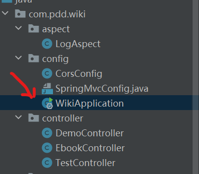

# 分层

### Controller

> 接口  - 后端提供给前端的URL

```java
package com.pdd.wiki.controller;

import org.springframework.web.bind.annotation.RequestMapping;
import org.springframework.web.bind.annotation.RestController;

@RestController
public class TestController {

    @RequestMapping("/hello")
    public String hello() {
        return "Hello World" + testHello;
    }
}
```

#### Controller和RestController

Controller - 返回页面

> Controller - 前后端分离，用不到了

RestController - 返回字符串

> RestController  - 支持所有请求 GET, POST, PUT, DELETE

具体的请求，一一对应

1. GET - GetMapping
2. POST - PostMapping


#### @ComponentScan

作用： 扫描包

```
// 注明扫描的位置
@ComponentScan("com.pdd")
```


##### 修改启动类位置



```
package com.pdd.wiki.config;

import org.mybatis.spring.annotation.MapperScan;
import org.slf4j.Logger;
import org.slf4j.LoggerFactory;
import org.springframework.boot.SpringApplication;
import org.springframework.boot.autoconfigure.SpringBootApplication;
import org.springframework.context.annotation.ComponentScan;
import org.springframework.core.env.Environment;

// 注明扫描的位置
@ComponentScan("com.pdd")
@SpringBootApplication
@MapperScan("com.pdd.wiki.mapper")
public class WikiApplication {

    private static final Logger LOG = LoggerFactory.getLogger(WikiApplication.class);

    public static void main(String[] args) {

        SpringApplication app = new SpringApplication(WikiApplication.class);
        Environment env = app.run(args).getEnvironment();
        LOG.info("启动成功！！");
        LOG.info("地址: \thttp://127.0.0.1:{}", env.getProperty("server.port"));
    }
}
```

