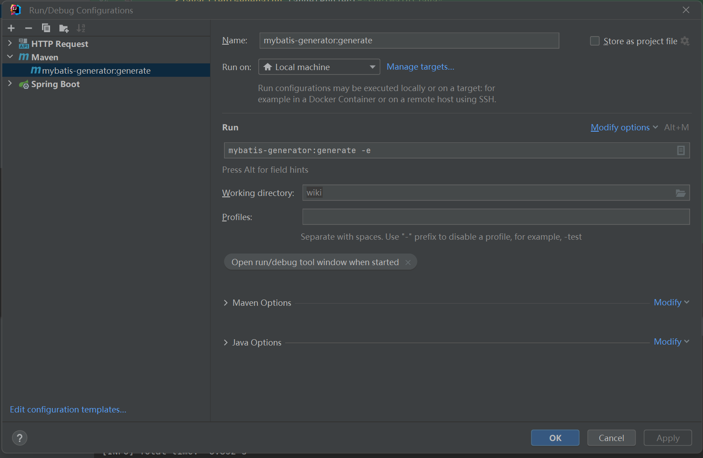

# Mybatis官方代码生成器

#### 插件

```xml
<!-- mybatis generator 自动生成代码插件 -->
<plugin>
    <groupId>org.mybatis.generator</groupId>
    <artifactId>mybatis-generator-maven-plugin</artifactId>
    <version>1.4.0</version>
    <configuration>
        // 配置文件
        <configurationFile>src/main/resources/generator/generator-config.xml</configurationFile>
        <overwrite>true</overwrite>
        <verbose>true</verbose>
    </configuration>
    // 数据库连接
    <dependencies>
        <dependency>
            <groupId>mysql</groupId>
            <artifactId>mysql-connector-java</artifactId>
            <version>5.1.38</version>
        </dependency>
    </dependencies>
</plugin>
```


##### 配置文件

位置：generator/generator-config.xml


##### 代码案例

```xml
<?xml version="1.0" encoding="UTF-8"?>
<!-- MyBatis-Generator 相关配置 -->
<!DOCTYPE generatorConfiguration
        PUBLIC "-//mybatis.org//DTD MyBatis Generator Configuration 1.0//EN"
        "http://mybatis.org/dtd/mybatis-generator-config_1_0.dtd">

<generatorConfiguration>
    <!-- 引入外部配置文件   -->
	<!--<properties resource="mybatis-generator.properties"/>-->

    <context id="Mysql" targetRuntime="MyBatis3" defaultModelType="flat">

        <!-- 自动检查关键字，为关键字增加反引号 -->
        <property name="autoDelimitKeywords" value="true"/>
        <property name="beginningDelimiter" value="`"/>
        <property name="endingDelimiter" value="`"/>

        <!--覆盖生成XML文件-->
        <plugin type="org.mybatis.generator.plugins.UnmergeableXmlMappersPlugin" />
        <!-- 生成的实体类添加toString()方法 -->
        <plugin type="org.mybatis.generator.plugins.ToStringPlugin"/>

        <!-- 不生成注释 -->
        <commentGenerator>
            <property name="suppressAllComments" value="true"/>
        </commentGenerator>
		
		// 改动地方
        <jdbcConnection driverClass="com.mysql.jdbc.Driver"
                        connectionURL="jdbc:mysql://localhost:3306/wiki?characterEncoding=UTF8&amp;useSSL=false"
                        userId="wiki"
                        password="wiki">
        </jdbcConnection>
		
		// 改动地方
        <!-- 注意设置文件路径 -->
        <!-- 实体类的位置 -->
        <javaModelGenerator targetProject="src\main\java"
                            targetPackage="com.pdd.wiki.domain"/>

        <!-- mapper xml的位置 -->
        <sqlMapGenerator targetProject="src\main\resources"
                         targetPackage="mapper"/>

        <!-- mapper类的位置 -->
        <javaClientGenerator targetProject="src\main\java"
                             targetPackage="com.pdd.wiki.mapper"
                             type="XMLMAPPER"/>
		
		// 使用的地方
        <!--<table tableName="demo" domainObjectName="Demo"/>-->
		<!--<table tableName="demo"/>-->
        <table tableName="ebook"/>
        <!--        设置要生成对应类的表名-->
        <!--        <table tableName="test"/>-->
    </context>
</generatorConfiguration>
```


##### IDEA创建启动命令




生成(不要修改)

domain

1. Demo.java
2. DemoExample.java

mapper

1. Demo.Mapper.java

resources/mapper

1. DemoMapper.xml


接着写service和controller