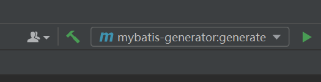

# 重点

### 准备

1. sql语句
2. generator-config.xml - table


#### SQL

```sql
create table `ebook`(
    `id` bigint not null  comment 'id',
    `book_name` varchar(50) comment '书名',
    `category_1` bigint comment '分类1',
    `category_2` bigint comment '分类2',
    `book_desc` varchar(50) comment '书的描述',
    `book_cover` varchar(50) comment '书的封面',
    `doc_count` bigint comment '文档数',
    `view_count` bigint comment '访问人数',
    `like_count` bigint comment '点赞数',
    primary key(`id`)
)engine=innodb default charset=utf8mb4 comment 'EBook';

insert into `ebook`(id, book_name, book_desc) values (1, 'JavaScript高级程序设计', 'js必备');

insert into `ebook`(id, book_name, book_desc) values (2, 'Java高级程序设计', 'java必备');
```

1. 选中执行的sql代码，鼠标右键 **Execute**
2. 两次 **shift**  搜索generator-config.xml，新增一行table，修改table，注释上一行table
3. 选择生成器，执行


#### Table

```xml
 <table tableName="ebook"/>
```

```xml
<?xml version="1.0" encoding="UTF-8"?>
<!-- MyBatis-Generator 相关配置 -->
<!DOCTYPE generatorConfiguration
        PUBLIC "-//mybatis.org//DTD MyBatis Generator Configuration 1.0//EN"
        "http://mybatis.org/dtd/mybatis-generator-config_1_0.dtd">

<generatorConfiguration>
    <!-- 引入外部配置文件   -->
<!--    <properties resource="mybatis-generator.properties"/>-->

    <context id="Mysql" targetRuntime="MyBatis3" defaultModelType="flat">

        <!-- 自动检查关键字，为关键字增加反引号 -->
        <property name="autoDelimitKeywords" value="true"/>
        <property name="beginningDelimiter" value="`"/>
        <property name="endingDelimiter" value="`"/>

        <!--覆盖生成XML文件-->
        <plugin type="org.mybatis.generator.plugins.UnmergeableXmlMappersPlugin" />
        <!-- 生成的实体类添加toString()方法 -->
        <plugin type="org.mybatis.generator.plugins.ToStringPlugin"/>

        <!-- 不生成注释 -->
        <commentGenerator>
            <property name="suppressAllComments" value="true"/>
        </commentGenerator>

        <jdbcConnection driverClass="com.mysql.jdbc.Driver"
                        connectionURL="jdbc:mysql://localhost:3306/wiki?characterEncoding=UTF8&amp;useSSL=false"
                        userId="wiki"
                        password="wiki">
        </jdbcConnection>

        <!-- 注意设置文件路径 -->
        <!-- 实体类的位置 -->
        <javaModelGenerator targetProject="src\main\java"
                            targetPackage="com.pdd.wiki.domain"/>

        <!-- mapper xml的位置 -->
        <sqlMapGenerator targetProject="src\main\resources"
                         targetPackage="mapper"/>

        <!-- mapper类的位置 -->
        <javaClientGenerator targetProject="src\main\java"
                             targetPackage="com.pdd.wiki.mapper"
                             type="XMLMAPPER"/>
		
        // 修改的位置
        <!-- <table tableName="demo" domainObjectName="Demo"/> -->
		<!-- <table tableName="demo"/> -->
        <table tableName="ebook"/>
        <!-- 数据库的表名 -->
        <!-- <table tableName="test"/> -->
    </context>
</generatorConfiguration>
```

#### 代码生成器



#### 生成

```
[INFO] Saving file EbookMapper.xml
[INFO] Saving file EbookExample.java
[INFO] Saving file Ebook.java
[INFO] Saving file EbookMapper.java
```


#### Service

```java
package com.pdd.wiki.service;

import com.pdd.wiki.domain.Ebook;
import com.pdd.wiki.mapper.EbookMapper;
import org.springframework.stereotype.Service;

import javax.annotation.Resource;
import java.util.List;
@Service
public class EbookService {

    @Resource
    private EbookMapper ebookMapper;

    public List<Ebook> list() {
        return ebookMapper.selectByExample(null);
    }
}

```


#### Controller

```java
package com.pdd.wiki.controller;

import com.pdd.wiki.domain.Ebook;
import com.pdd.wiki.service.EbookService;
import org.springframework.web.bind.annotation.GetMapping;
import org.springframework.web.bind.annotation.RequestMapping;
import org.springframework.web.bind.annotation.RestController;

import javax.annotation.Resource;
import java.util.List;

@RestController
@RequestMapping("/ebook")
public class EbookController {

    @Resource
    private EbookService ebookService;

    @GetMapping("/list")
    public List<Ebook> list() {
        return ebookService.list();
    }
}

```


#### 验证http

```
GET http://localhost:8882/ebook/list
Accept: application/json

###
```


