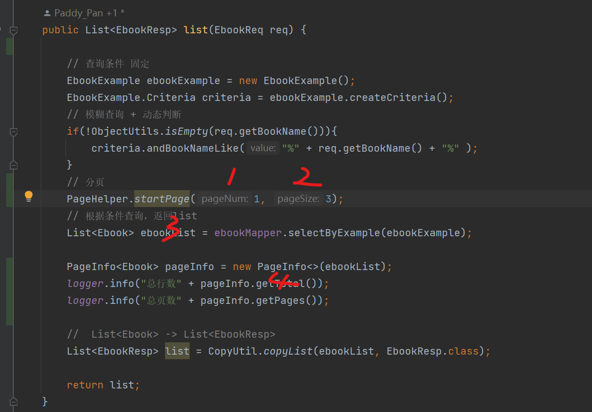

# pageHelper

#### 依赖

```xml
<dependency>
    <groupId>com.github.pagehelper</groupId>
    <artifactId>pagehelper-spring-boot-starter</artifactId>
    <version>1.2.13</version>
</dependency>
```


```java
// 分页 从1开始，只对第一个sql起作用
PageHelper.startPage(1, 3);
```


tips 这两行放在一起，不容易出错

```
// 分页
PageHelper.startPage(1, 3);
// 根据条件查询，返回list
List<Ebook> ebookList = ebookMapper.selectByExample(ebookExample);
```


### pageInfo

```java
PageInfo<Ebook> pageInfo = new PageInfo<>(ebookList);
logger.info("总行数" + pageInfo.getTotal());
logger.info("总页数" + pageInfo.getPages());
```


#### 四个数据

12请求

34返回

